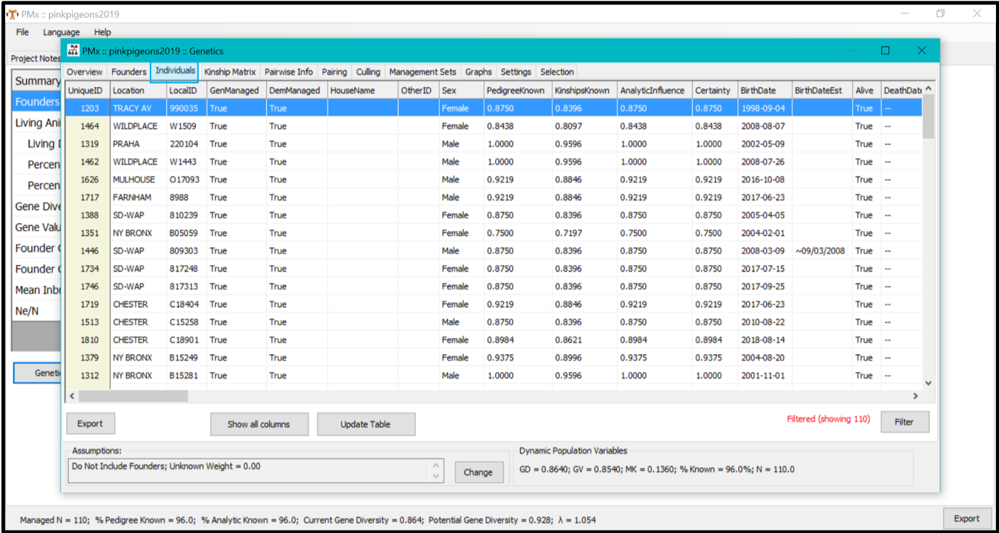
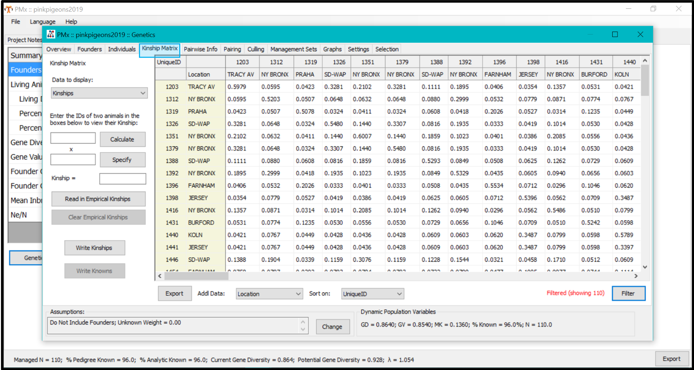

# How to generate data file

ICY requires two data-files (*Genetic information from studbook*, *Kinship matrix from studbook*) to generate a table of individuals for reintroduction and an extra file (*Founder information from studbook*) if the user wants t o generate a downloadable report which includes population level information.  This must be generated in a specific way to ensure ICY has the data it requires, the information below demonstrates how to generate the datafile from Pmx and Sparks studbook software. If you use a different studbook software it may be compatible but please email Camilla Ryan (camilla.ryan@earlham.ac.uk) to discuss it.

## Generating data from Pmx software

For users who are familiar with Pmx the following summary explains how to download the three files required by Pmx. For users who are less familiar there are more thorough details below.

### Summary of steps to generate data files

**NB** The following steps discuss how to generate the data files needed for ICY but do not include any extra filtering of individuals a practitioner may want to do based on age, location or other factors. For further information on Pmx see the manual: http://www.vortex10.org/Downloads/PMxManual.pdf

1. Go to the ***Genetics*** tab
2. Within the ***Genetics*** tab go to the ***Founders*** tab 
3. Export the file in the ***Founders*** tab making sure to use the dropdown box *Save as type:* to select **<u>CSV Files (*.csv)</u>** files. This will be used as input for the ICY box labelled ''Founder information from studbook"
4. Within the ***Genetics*** tab go to the ***Individuals*** tab
5. Click *Show all columns* (button located beneath the table)
7. Export the table as a **csv** file. This will be used as input for the ICY box labelled ''Genetic information from studbook"
8. Within the ***Genetics*** tab go to the ***Kinship Matrix*** tab
9. Underneath the table on the right hand side click the *Filter* button
10. Select *Only show animals where* and use the dropdown menu to select **Gone, =,** then write False. As above this will ensure we only have living animals in our matrix 
11. Export as **csv** file. This will be used as input for the box labelled ''Kinship matrix from studbook"

### Detailed steps to generate data file

**NB** The following steps discuss how to generate the data files needed for ICY but do not include any extra filtering of individuals a practitioner may want to do based on age, location or other factors. For further information on Pmx see the manual:https://scti.tools/manuals/PMxManual.pdf

### 1. Go to the ***Genetics*** tab

### 2. Click on *Genetic Details button*

### 3. You will automatically be on the ***Overview*** tab instead navigate to the ***Founders*** tab.

### 4. Once within the ***Founders*** tab click the *Export* button

### 5. Save table as a csv file

When you click the *Export* button a *Save as* window will appear. Near the bottom is the option to change the *Save as type:* by using a dropdown menu. Make sure you change it to <u>**CSV Files (*.csv)**</u>. This will be used as input for the ICY box labelled ''Founder information from studbook"

### 6. Navigate to the **Individuals** tab

### 7. Underneath the table click the button *Show all columns*

### 8. Export the table as **csv** file. 

This will be used as input for the ICY box labelled  ''Genetic information from studbook"

### 9. Navigate to the ***Kinship Matrix*** tab

### 10. Export as **csv** file. 

This will be used as input for the box labelled ''Kinship matrix from studbook"

### Manual and citations

#### Pmx manual

https://scti.tools/manuals/PMxManual.pdf

#### Pmx software

https://scti.tools/downloads/#tab-014ad580a4714a49f97

#### Reference

Ballou, J., Lacy, R. and Pollak, J. 2010. *PMx: software for demographic and genetic analysis and management of pedigreed populations*. Brookfield, Illinois, USA.: Chicago Zoological Society.