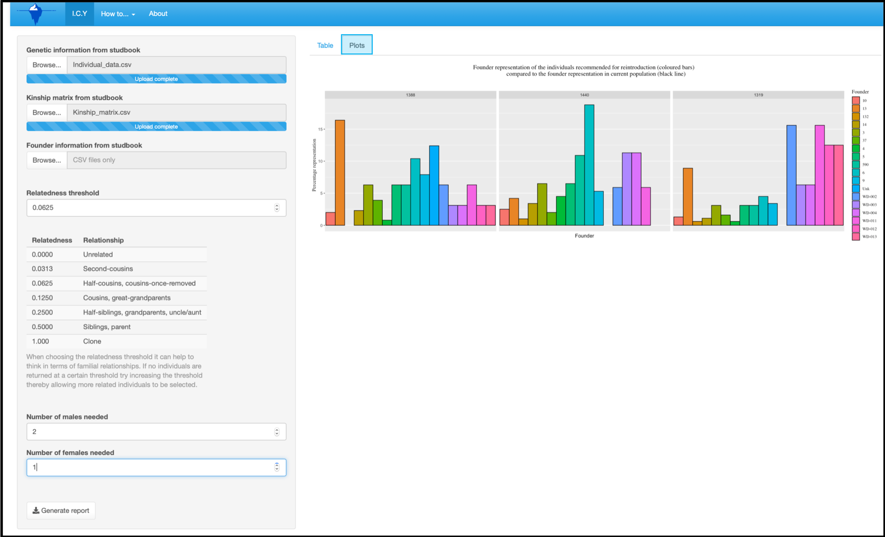
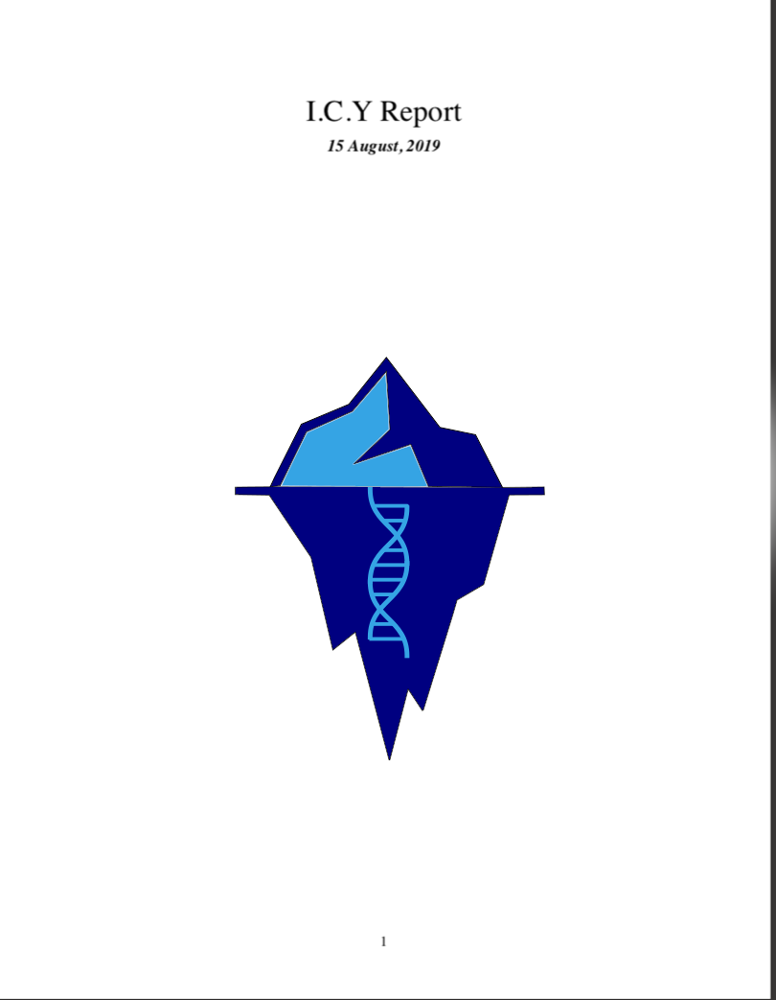

# How to use I.C.Y

ICY is designed to be as simple as possible - plug in your data and go. In order to work ICY expects specific data files, and with extension **.csv**. If you are unsure of what data is required by ICY see **How to generate data files** in the **How to. . .** tab above. Clicking the **I.C.Y** tab will take you back to the home page.

### 1. Starting off

The screen below will be the first screen you see when you load ICY. Help can be found under the tab **How to. . . ** and there are FAQs under the **About** tab.

### 2. Loading in data

Assuming the data files are correct you load files by clicking the *browse* button and searching on your computer for the correct files ( your screen here may look different from the image below depending on the computer system used). The first box is *Genetic information from studbook* this is where you can upload the file with all the information that has been downloaded about the individuals of interest from the studbook software.  The next box *Kinship matrix from studbook* is the pairwise kinship matrix generated for your individulas of interest by the studbook software. 

The final box is for *Founder information from studbook* this only needs to be uploaded if you want to generate a downloadable report or, you want to generate plots that include a line representing the founder representation of the population as a whole which you can compare to the chosen individuals founder representation.

Otherwise ICY can produce a table and plots of individulas to reintroduce using just the first two files.

### 3. Adjusting parameters

As soon as both files (*Genetic information from studbook*, *Kinship matrix from studbook* )have been loaded an empty table with caption will automatically appear (as below). 

ICY updates automatically as you change parameters and may output table and plots before you have finished inputting parameters this is because the default value of *Number of males needed* and *Number of females needed* is 0. Although the table will not fill and plots will not appear until *Relatedness threshold* and **<u>at least one</u>** of those parameters have been added. 

You can however continue to adjust parameters as much you like and ICY will continue to update both the table and plots. You can enter the values for these three parameters manually or use the ^v buttons at the side. 

Crucially make sure to check your parameter  and do not enter negative numbers!

Once the parameters are entered a table should fill with a group of individuals that are suitable for reintroduction as below and plots should appear under the *Plots* tab.

You access the plots by clicking on the *Plots* tab (if you want to return to the table view simply click on the *Table* tab).

This is what the plots look like when you **<u>have not</u>** uploaded a file to *Founder information from studbook* **NB** these plots may take a few seconds to load once you have clicked on the *Plots* tab.

This is what the plots look like when you **<u>have</u>** uploaded a file to *Founder information from studbook* 

It is possible that you may encounter the below error having uploaded the two files and entered the three input parameters. This is fine it simply means that there is not a group of individuals with the number of males/females stated that are less related then threshold that was specified. If this happens you can try altering the number of individuals you want to reintroduce or increase the *Relatedness threshold* this means you are allowing individiuals to be more related. The level of relatedness that is acceptable will depend on the population in question and the practioners judgement. A table of relatedness thresholds and familial relationships is below the input box to help users make decisions about what is appropriate however you can enter <u>**any**</u> value between 0 and 1 not just those in the table.

### 4. Generating reports

ICY allows the user to generate an indepth report about the selection of individuals in the data files entered by the user. This report contains information about how ICY works, the representation of founders in the current population, information about the founder representation in every individula in the population. In order to generate this report the user must upload a founder contribution file ( which can be easily generated from studbook software)  **<u>as well as</u>** the other files and input parameters required and mentioned above. Then simply click *Generate report* and a pdf named ICY_report.pdf will be downloaded wherever your files download.

