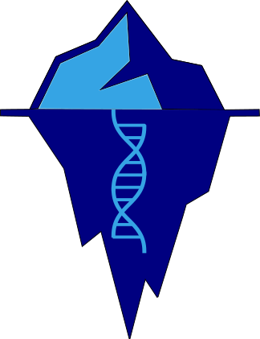

#  I.C.Y

*Preserve genetic diversity: Make informed choices for individual reintroductions*

## Description

### What is ICY?

**I** **C**hoose **Y**ou helps conservation practitioners select captive individuals for 
translocation/reintroduction/genetic rescue, based on their theoretical genetic diversity.

ICY considers three input constraints: the number of males wanted, the number of females wanted, 
and a threshold for the level of relatedness between the chosen birds. 

ICY reports the individuals that should be selected for transolcation that would maximise
genetic diversity, given the three constraints.

ICY can also generate a downloadable report. The report provides more thorough explanations
about the analysis ICY performs, and presents more informationb about the individuals within a given population.

The source code can find ICY on Github here: https://github.com/Mills33/ICY-I-Choose-You-
ICY is MIT Licensed.


#### Why ICY?

Captive breeding programmes by zoos and other conservation practicioners are critical for 
conserving species.
The purpose of such programmes is to introduce individuals that support endangerd wild 
populations and help recover. This works because the introduced individuals are often 
genetically  distinct to the wild individuals, and so introducing them increases the
genetic diversity of the wild population's gene pool. This helps the population overcome common 
genetic problems that endangerd and reduced populations have, such as inbreeding depression,
which cause all kinds of health problems.

To make the most of these reintroductions individuals that will maximise the genetic diversity
in the wild population should be chosen. However, practitioners don't often have access to 
current sequencing data, or the genomics expertise to be able to interpret such data.
Some projects have some form of pedigree data for the wild population as well as the captive
one, and this data can be used to infer which individuals may be better to reintroduce than others.
However, some projects have none of these data and in such cases the individuals chosen for reintroduction may be picked blindly. 

Many projects have a studbook and its information can be used to calculate a measure of 
theoretical genetic diversity for each individual in the population.
This metric is called **founder equivalents**, and groups of individuals can be selected
which are as diverse as possible whilst not being too related to each other.

ICY was designed to allow practitioners to quickly compute such an analysis and obtain a good
selection of individuals based on the theoretical genetic diversity of captive individuals
being considered for translocation/reintroduction/genetic rescue.
It is aimed at practitioners who do not have any genetic data.
Whilst ICY does not guarantee THE optimal result, and does not consider pragmatic considerations 
(those are up to the practitioners), it should result in genetically healthier decisions than 
choosing individuals blindly (at random).


#### How

ICY takes as input three csv files all readily available to download from studbook software such
as Sparks or PmX.
See the tab **'How to. . .'** above to make sure the correct files are generated.
ICY then uses Python functions to format the data and calculates the number of founder
equivalents (Fe) per individual and ranks birds based on Fe and mean kinship coefficient (MK).
Finally given the three input parameters (**number of males, number of females, relatedness
threshold**) it will calulcate a group (where the group size is equal to number of males + number
females specified) of individuals which are the highest ranked individuals that are all less
related than the specified relatedness threshold. The methods employed by ICY are deisgned to
maximise geentic diversity and help prevent inbreeding. 

Important to note just because ICY suggests a group of individuals does not necessarily mean these are the best individuals for reintroduction/translocation. This because there are many
other pragmatic considerations such as age, location, health that may be relevant that ICY does
not consider. Many pragmatic decisions can be thought through before generating the data for ICY
(for example age) so that the input data only contains a subset of individuals from the whole
population deemed most appropriate by the user. Ultimately the decision of which individuals to
reintroduce belongs to the practitioners, ICY is designed to provide an easy way for users to
integrate genetic health into their decisions in the hope of promoting healthier and more stable
populations.


## Installation & Use

### Use our I.C.Y. Deployment

We've already built and deployed I.C.Y. on Heroku so you don't have to!

Just head over [here](https://dry-caverns-77518.herokuapp.com/) and use it.

Note: our deployment is currently in a Heroku free dyno, and so sometimes the page-load
times are wanting!

### Deploy your own or run locally

I.C.Y is a shiny web-application, and it is packaged into a docker container.
To run it locally you can clone this repository, and from the root directory, issue
the following shell commands to build and run the container.

```sh
export PORT=80 # Set the port for the app to listen on.
docker build -t my-icy-app .
docker run --rm -p 80:80 my-icy-app # Make sure -p argument matches port set above.
```

You could use


## Having Issues?

1. Please read the FAQs (below).
2. If the FAQs do not help please [open an issue](https://github.com/Mills33/ICY/issues)
   Describe your issue as clearly as you can, any printed error messages or screenshots will
   help.


## FAQs

1. **Error**: index 0 is out of bounds for axis 0 with size 0 - this means it is not possible to
have the number or males and number of females at the threshold you have set because they are all
more related than that threshold. To solve this you can try decreasing the threshold (*ie*
increasing the allowed realtedness between individuals in a group) or try decreasing either the
number or males and/or the number of females.
